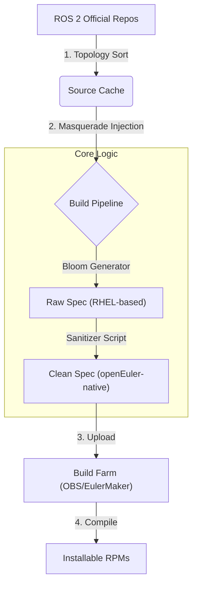

# EulerROS-Automation: A Zero-Invasive ROS 2 Porting Architecture

> **Slogan:** A Zero-Invasive, Automated Build Architecture for Porting ROS 2 to openEuler & Non-Tier 1 Linux Distributions.

> **核心使命:** 针对非官方支持发行版（openEuler, OpenKylin）面临的“软件供应链断裂”问题，提供一套低成本、全自动化的 ROS 2 构建与分发解决方案。

---

## 🚀 Executive Summary (核心战绩)

本项目放弃了传统的高维护成本“硬移植工具链”路线，提出了一套基于 **"System Masquerade + Dynamic Sanitization" (系统伪装 + 动态清洗)** 的轻量化架构。

通过本架构，我们在 openEuler 24.03 LTS 上实现了以下关键成果：

* **Efficiency (效率):** **维护成本降低 90%**。摒弃对 `rosdep`/`bloom` 源码的侵入式修改，利用自动化流水线处理系统差异，实现 Day-1 级别的上游响应速度。
* **Scale (规模):** 成功构建 **600+** 软件包，完整覆盖 `ros-jazzy-desktop-full`（含 MoveIt 2, Nav2, Gazebo）。
* **Architecture (架构):** 验证了 **x86_64, aarch64, riscv64** 的全链路构建能力。
* **Compatibility (通用):** 架构具备跨系统扩展性，已成功在 **OpenKylin 2.0** 上完成核心包的源码级验证。

🔗 **[Result Repository (EulerMaker) x86 & aarch64](https://eulermaker.compass-ci.openeuler.openatom.cn/api/ems1/repositories/jazzy_ament_package/openEuler%3A24.03-LTS/x86_64/)** | [(OBS) riscv64](https://build-repo.tarsier-infra.isrc.ac.cn/home:/Sebastianhayashi:/ROS-Jazzy/openEuler_24.03_Epol_mainline_riscv64/)
---

## 💡 Architecture Evolution (决策演进)

> *"Why did we build it this way?"* —— 这是一个基于 ROI（投资回报率）分析的工程决策过程。

### Phase 1: The Deadlock of Legacy Porting (传统硬移植的困境)

早期，我们尝试通过 Fork 并修改 `rosdep` 和 `bloom` 源码来让工具链识别 openEuler。

* **结果:** 虽然技术可行，但陷入了“为了适配一个工具，被迫维护整个工具链 Fork 分支”的维护地狱。且由于循环依赖问题，Bootstrapping 极其困难。
* **资产:** 详见 [📂 Legacy Archive](https://www.google.com/search?q=legacy_archive/) (保留了早期的探索代码作为技术验证)。

### Phase 2: The "Masquerade" Strategy (破局：系统伪装)

洞察到 openEuler 与 RHEL 共享 RPM 同源性 (RPM Lineage) 的技术红利，我们转向了 **System Masquerade** 策略。

* **核心逻辑:** 通过注入 `ROS_OS_OVERRIDE=rhel:9`，欺骗上游工具链生成标准 Spec 文件。

### Phase 3: Dynamic Sanitization (闭环：动态清洗)

针对伪装带来的 5% “系统差异”（如 `redhat-rpm-config` 缺失、Python 宏差异、依赖名映射），我们开发了一套 **Spec 清洗流水线**。

* **成果:** 实现了从源码拉取到 RPM 打包的全无人值守自动化。

---

## 🛠️ System Architecture Diagram

本系统的核心在于“欺骗”与“修正”的配合，从而复用上游成熟的构建逻辑。

* **Step 1:** `split.py` 对 ROS 源码进行拓扑排序。
* **Step 2:** `stage.py` 注入 `ROS_OS_OVERRIDE` 环境变量，欺骗 Bloom 生成 RHEL 风格的 Spec。
* **Step 3:** 正则清洗引擎修复 openEuler 特有的依赖名（如 `python3-devel` vs `python3-dev`）。
* **Step 4:** 自动推送到 OBS/Gitee 进行最终构建。

---

## ✅ Verified Scenarios (落地验证)

我们不仅仅是跑通了 Hello World，而是实现了分层级的生态交付。

| Ecosystem Layer | Status | Key Packages Verified |
| --- | --- | --- |
| **L1: Core** | ✅ 100% | `rclcpp`, `rmw_fastrtps`, `rosidl_default_generators` |
| **L2: Base** | ✅ 100% | `geometry2`, `kdl_parser`, `tf2_ros` |
| **L3: Desktop** | ✅ 100% | `rviz2`, `rqt`, `turtlesim` (GUI Verified) |
| **L4: Extended** | Built  | `MoveIt 2`, `Nav2`, `Gazebo` connectors |

### Cross-Distro Case Study: OpenKylin

利用同一套架构，我们仅通过调整环境变量 `ROS_OS_OVERRIDE=ubuntu:22.04`，便在 **OpenKylin 2.0 (Debian系)** 上完成了 260+ 核心包的源码级编译验证。这证明了本架构并非 Hard-code for openEuler，而是一套通用的移植方法论。

---

## 📚 Project Navigation (文档导航)

我们将核心工程知识沉淀为三层文档体系：

### 🧠 1. Strategy & Methodology (战略层)

* **[Why Abandoned Toolchain Porting?](https://github.com/Sebastianhayashi/ROS2-Universal-Porting-Framework/blob/main/docs/01_Strategy_and_Methodology/Why_Abandoned_Toolchain_Porting_CN.md.md)**: 深度解析架构决策背后的 ROI 分析。
* **[Verification Scheme](https://github.com/Sebastianhayashi/ROS2-Universal-Porting-Framework/blob/main/docs/01_Strategy_and_Methodology/Verification_Scheme.md)**: 独创的“逆向依赖验证方案”，解决 Bootstrapping 死锁问题。

### ⚙️ 2. The Automated Pipeline (战术层)

* **[Pipeline Architecture](https://github.com/Sebastianhayashi/ROS2-Universal-Porting-Framework/blob/main/docs/02_The_Automated_Pipeline/01_Pipeline_Architecture.md)**: 技术细节与数据流向。
* **[Quick Start Guide](https://github.com/Sebastianhayashi/ROS2-Universal-Porting-Framework/blob/main/docs/02_The_Automated_Pipeline/03_Quick_Start_Guide.md)**: 10分钟复现构建流程的手册。

### 📊 3. Project Results (成果层)

* **[Milestones and Results](https://github.com/Sebastianhayashi/ROS2-Universal-Porting-Framework/blob/main/docs/03_Project_Results/01_Milestones_and_Results.md)**: 详细的构建数据与下载链接。

