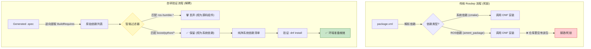

# 系统级依赖验证方案

该文档主要阐述了为什么放弃了 `rosdep install`  的标准流程。核心在于解决 ROS 从 0 构建（Bootstrapping）阶段的自举死锁的问题，以及 `rosdep check` 在非官方平台上不可靠的问题。

## 1. 为什么说标准流程走不通

在 openEuler 上从源码构建 ROS 的初期（Bootstrapping 阶段），发现直接运行 rosdep install 会导致严重的逻辑死锁。这迫使我们必须设计一套智能区分“系统依赖”与“ROS 组件”的验证工具。


1.1 自举死锁 (The Bootstrapping Paradox)

在执行 colcon build 之前，我们需要安装依赖。rosdep 会扫描源码中的 package.xml。例如，当我们要构建 ROS 2 的构建基座 ament_cmake 时，它的 package.xml 包含如下声明：

```
<buildtool_depend>ament_package</buildtool_depend>
<buildtool_depend>python3-catkin-pkg-modules</buildtool_depend>
```
死锁逻辑：

1. rosdep 扫描到 ament_package 依赖。

2. 它发现当前环境未安装该包。

3. 它试图调用系统包管理器（DNF）去安装 ros-jazzy-ament-package。

4. 我们当前的任务是从零构建 ROS，系统仓库里根本没有 ros-humble- 开头的包.

为了绕过这个问题，通常的做法是维护一个巨大的 `--skip-keys` 列表，手动忽略 `ament_package`, `rclcpp` 等几十个 ROS 基础包。随着构建规模扩大（500+ 包），这个黑名单将变得不可维护。

在 openkylin（同样为 ROS 官方不支持的平台）上进行复现的时候一样维护了一个很长的清单：

```
rosdep install -y --rosdistro jazzy --from-paths src --ignore-src \
  --skip-keys="\
rmw_connextdds \
rmw_connextdds_common \
rti-connext-dds-6.0.1 \
rosidl_typesupport_connext_c \
rosidl_typesupport_connext_cpp \
connext_cmake_module \
rti_connext_dds_cmake_module \
python3-vcstool \
python3-catkin-pkg-modules \
python3-rosdistro-modules \
python3-mypy \
ros-jazzy-example-interfaces \
ros-jazzy-gz-math-vendor \
ros-jazzy-diagnostic-updater \
ros-jazzy-rqt-action \
ros-jazzy-pcl-msgs \
libpcl-common \
ros-jazzy-resource-retriever \
libpcl-features \
libpcl-io"
```

1.2 `rosdep check` 不靠谱

即使解决了死锁的问题，在进行标准流程执行 `rosdep check` 发现一样存在问题。

因为 `rosdep check` 的逻辑是只检查 YAML 里的 Key 是否存在，不检查 Value 对应的 RPM 包在系统里是否真的叫这个名字（例如 opencv vs opencv.riscv）.

## 2. 解决方案：逆向提取与智能分层

为了解决上述“死锁”，我们设计了一套 “基于 Spec 的逆向验证方案”。

这套方案的核心价值在于 Filter（过滤）：它能自动识别哪些是**“系统级依赖”（必须验证），哪些是“ROS 内部组件”**（当前正在构建，无需验证）。

### 2.1 核心逻辑：Extract -> Filter -> Verify
我们不再依赖 package.xml 的原始声明，而是解析经过 Bloom 处理后的 .spec 文件。

1. Source of Truth (Spec 文件)： .spec 文件是 RPM 构建的最终指令集。它比 package.xml 更准确，因为它已经经过了伪装策略的处理。

2. Smart Filtering (解决死锁的关键)： 我们在提取 BuildRequires 时引入了分层过滤逻辑：

- Rule A: 如果依赖名以 ros-humble- 开头（或符合当前 ROS 命名规范），自动忽略。因为这代表它是源码空间的一部分，稍后会被 colcon 构建出来。

- Rule B: 如果依赖名是 boost, python3, tinyxml2 等系统库，保留。这些才是我们需要向 OS 索要的基础设施。

3. Dynamic Probe (实弹验证)： 对过滤后的纯净清单，直接调用 dnf install 进行验证。

### 2.2 工作流示意图



## 3. 方案价值 (Engineering Value)

该方案是作为自动化构建流水线能够跑通的重要前置方案.

首先是我们不需要每一次去维护一个 `--skip-keys` 的一个清单。

且实际上通过 dnf install 我们就可以知道哪些包是可以正常被安装的，哪些是缺少的，也可以最快的向上游反应包情况。

而且这样就完全摆脱了对于 `rosdistro` 的依赖，我们的验证只基于当前的 spec 以及系统的情况。

## 其他说明

建议在 chroot 等非主要生产环境跑该方案，否则可能会污染主要的系统环境。