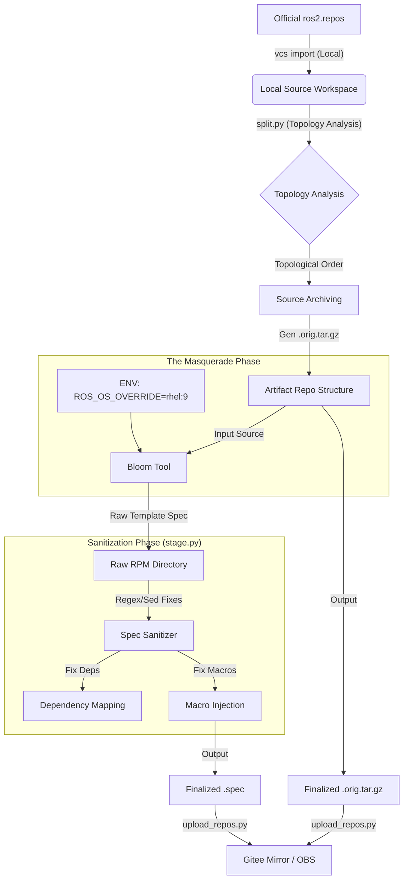

# Pipeline Architecture: From Source to RPM

本流水线的设计目标是建立一个确定性（Deterministic）、可断点（Resumable）且最小化侵入（Minimal-invasive）的构建系统。它负责将 ROS 官方源码转化为 openEuler 构建系统（Eulermaker/OBS）可识别的标准 RPM 资产。

核心设计哲学是 "System Masquerade + Dynamic Sanitization"（系统伪装 + 动态清洗）：即在生成阶段欺骗工具链，在后处理阶段修正偏差，而非维护一套庞大的自定义工具链源码。

## 1.1 Data Flow Diagram (数据流图)



## 2. Source Management & Network Optimization

解决 ROS 源码依赖分散、国内网络拉取不稳定以及构建环境（Eulermaker/OBS）的无网隔离（Air-gapped）限制。

### 2.1 源码获取与拓扑排序 (Source Acquisition)

输入并非单一的 Git URL，而是 ROS 2 官方维护的 ros2.repos 元数据文件。

流水线首先调用 vcs import src < ros2.repos 将上百个仓库拉取至本地 src/ 目录。

- 本地开发机（或代理节点）负责执行 vcs import，此阶段允许访问 GitHub。

- 最终产物不依赖 GitHub。脚本 upload_repos.py 会将处理后的源码和 Spec 推送至 Gitee 企业仓。构建平台（Eulermaker）仅与 Gitee 交互，从而规避了构建节点的外网访问限制。

### 2.2 版本锁定与归档 (Archiving Strategy)

为了满足 RPM 打包规范（Source0 必须是固定归档），我们不直接使用 Git 目录。

- Script: split.py

- Logic:

  1. 执行 colcon list --topological-order 获取正确的依赖构建顺序。

  2. 解析 package.xml 提取 <version>。

- Strict Archiving: 使用 git archive 将源码打包为 ros-jazzy-<pkg>_<ver>.orig.tar.gz。

- Directory Mapping: 确保解压后的顶层目录名为 ros-jazzy-<pkg>-<ver>，避免 rpmbuild 在 %setup 阶段报错找不到目录。

## 3. The Masquerade Injection (伪装生成策略)

### 3.1 核心伪装逻辑 (The Masquerade)

我们利用 bloom-generate 对 RPM 系发行版的通用支持，通过环境变量注入实现“系统欺骗”。

```
export ROS_OS_OVERRIDE=rhel:9
bloom-generate rosrpm --ros-distro jazzy --os-name rhel --os-version 9 ...
```

因为 rhel:9 与 openEuler 24.03 同属 RPM 体系，这样就能让 Bloom 能够自动生成基于 RPM 的 BuildRequires 和 %build 脚本，而无需修改 Bloom 源码。

针对某些商业中间件（如 rti-connext-dds）在开源源中不存在导致解析卡死的问题，脚本内置了 30秒超时跳过机制，防止流水线阻塞。

## 4. Dynamic Spec Sanitization (Spec 文件的动态修复)

修正“伪装”带来的 5% 不兼容偏差（系统差异、路径差异、宏差异）。这是流水线中最关键的“后处理（Post-processing）”环节。

- Script: stage.py (集成于 fix_spec 逻辑)

### 4.1 Dependency Mapping (依赖修正)

通过正则替换（Regex Substitution）解决包名不一致问题：

- OpenCV Fix:

  - Issue: Bloom 生成 BuildRequires: opencv-devel，但 openEuler 可能使用 opencv 或 opencv.riscv。

  - Sanitization: 动态检测并替换，或者通过 sed 移除特定的 -devel 后缀（若系统包已包含头文件）。

- Python Package Naming:

  - Issue: RHEL 习惯用 python3-xxx，openEuler 规范倾向于使用宏。

  - Sanitization: 将硬编码的 python3-devel 替换为 python%{python3_pkgversion}-devel。

- Flake8 & Linters:

  - Issue: ament_flake8 依赖的 python3-flake8-builtins 等插件在 openEuler 上缺包。

  - Sanitization: 替换为 flake8-virtual（一个自制的虚包，规避依赖检查）或直接移除相关测试依赖。

### 4.2 Path & Environment Injection (路径与环境注入)

ROS 2 在 openEuler 上需安装至 /opt/ros/jazzy，而非默认的 /usr。

- 在 Spec 头部强制注入宏定义：

```
%define _prefix /opt/ros/jazzy
```

- 修改 %build 段，注入环境变量以修复 CMake 和 Python 的查找路径：

```
export PYTHONPATH=$PYTHONPATH:%{buildroot}/opt/ros/jazzy/lib/python%{python3_version}/site-packages
export CMAKE_PREFIX_PATH=%{buildroot}/opt/ros/jazzy
```

### 4.3 Infrastructure & Macro Sanitization (基建修复)

- Bytecompile Disable: RHEL 的 %__os_install_post 会强制对 Python 文件进行字节码编译，这在交叉编译或特定路径下可能报错。

  - Action: 注入 __os_install_post 覆盖原生宏，禁用自动字节码编译。

- Remove Ghosts:

  - Action: 移除 BuildRequires: redhat-rpm-config。这是 RHEL 特有的构建配置包，在 openEuler 上不存在且不需要。

- Middleware Enforcement:

  - Action: 强制指定中间件实现，避免构建系统寻找商业 DDS：
  
```
export RMW_IMPLEMENTATION=rmw_fastrtps_cpp
```

## 4. Artifact Organization (产物组织)

产出符合 openEuler 社区（openeuler-src）规范的仓库结构，便于 Git 管理和 OBS 导入。

5.1 Repository Structure
脚本执行完毕后，repos/ 目录下将形成如下标准结构：

```
repos/
├── ros-jazzy-rclcpp/                   # 仓库名
│   ├── ros-jazzy-rclcpp-2.0.2.orig.tar.gz  # 源码包 (Strict naming)
│   ├── ros-jazzy-rclcpp.spec               # 修复后的 Spec
│   ├── ros-jazzy-rclcpp.yaml               # 元数据 (上游信息)
│   └── README.md                           # 说明文档
└── ...
```

### 5.2 Delivery to Build System

`upload_repos.py` 脚本扫描该目录，将每个文件夹初始化为一个独立的 Git 仓库。

Result:

- 源码包与 Spec 位于同一层级。

= 生成 package_repos.yaml 清单，Eulermaker 可直接读取此清单批量导入工程。

- 所有产物均为静态文件，不包含任何构建时的动态下载指令。

该架构成功将“硬移植工具链”的高昂维护成本，转化为“自动化脚本维护”的低成本模式。通过 Phase 3 的动态修复，我们以极小的代价抹平了 openEuler 与 RHEL 之间的系统差异。