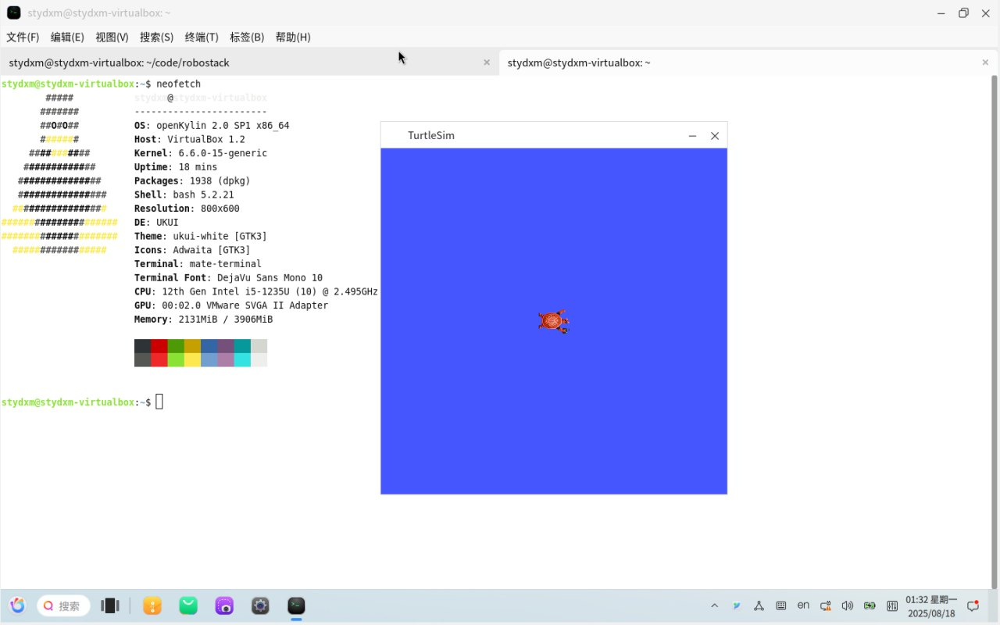

# Case Study: Cross-Distro Portability Verification on OpenKylin

## 1. The Challenge: Reconnaissance in the Wilderness (荒地侦察)

在完成 openEuler 的 RPM 打包适配后，我们面临一个新的需求：验证这套 ROS 2 Jazzy 源码架构是否具备跨国产系统的通用性，目标平台是 **OpenKylin 2.0 SP1**。

与 openEuler 不同，OpenKylin 当时尚未建立完善的 OBS 构建系统或官方软件源。因此，我们的战略目标发生了转变：

* **NOT Packaging (非打包交付):** 不追求生成 RPM 包或建立 yum/apt 仓库（因缺乏基础设施支持）。
* **BUT Verification (重在验证):** 利用 `colcon build` 在系统上直接进行源码编译，验证 **260+** 个 ROS Desktop 核心包在 OpenKylin 环境下的编译与运行兼容性。
* **And Diagnosis (问题分析):** 搜集并记录构建过程中遇到的系统级 Bug，为未来官方构建平台的上线积累数据。

## 2. Methodology: The "Colcon-First" Approach

我们采用了一种轻量级的验证路径，绕过了复杂的打包流程，直接测试代码与系统的契合度。

### 2.1 The "Masquerade" Strategy (再次复用伪装策略)

为了解决 `rosdep` 无法识别 OpenKylin 的问题，我们复用了流水线中的核心逻辑——**系统伪装**。

通过环境变量欺骗 `rosdep`，使其复用 Ubuntu 的依赖规则来安装系统库：

```bash
export ROS_OS_OVERRIDE=ubuntu:24.04:noble
rosdep install --from-paths src --ignore-src -y

```

这一步证明了我们的“伪装架构”不仅适用于 RPM 打包脚本，在开发者本地的 `colcon` 工作流中同样有效。

### 2.2 Multi-Architecture Compilation (多架构编译)

我们利用 QEMU 和真机资源，在三大架构上执行了 `colcon build --packages-up-to ros-desktop`：

* **x86_64:** 通过。
* **aarch64:** 通过。
* **riscv64:** 通过（使用自制 QEMU 镜像）。

## 3. The Diagnosis: Identifying Systemic Gaps (关键发现)

作为“侦察兵”，我们发现了 OpenKylin 2.0 SP1 在适配 ROS Jazzy 时存在的数个关键阻碍。这些发现比单纯的构建成功更有价值。

### 3.1 The "t64" Naming Schism (Debian time_t 过渡问题)

这是移植验证中发现的最大深坑。

* **现象:** `rosdep` 试图安装 `libcurl4t64` 等带 `t64` 后缀的包（源自 Ubuntu Noble 规则），但 OpenKylin 沿用了旧名 `libcurl4`。
* **影响:** 导致大量依赖安装失败。
* **临时解法:** 既然不打包，我们手动修改了本地的依赖映射或通过软链接规避。
* **价值:** 这一发现提示后续 OpenKylin 官方在建设 ROS 源时，必须在 rosdep 规则库中专门处理 `t64` 别名问题。

### 3.2 Header & Library Conflicts (头文件冲突)

* **Pybind11:** 发现系统预装的 `pybind11` 头文件与 ROS 源码自带版本存在哈希冲突，导致 `python_orocos_kdl_vendor` 编译失败。
* **Middleware:** 商业版 DDS 在缺乏闭源库支持的情况下会阻塞构建。

## 4. The Result: Functional Verification (成果验证)

尽管没有生成 RPM 包，但我们成功实现了 **Source-Level Closure (源码级闭环)**。

### 4.1 Quantitative Result

* **Build Coverage:** 成功通过 `colcon build` 编译了 **260+** 个软件包，完整覆盖了 `ros-desktop` 变体。
* **Visual Validation:** 成功启动 `turtlesim_node` 和 `rviz2`。



### 4.2 Strategic Value

这次验证工作的核心价值在于：

1. **Feasibility Confirmed:** 证明了 ROS 2 Jazzy Desktop 在 OpenKylin 上是可以跑通的，源码层面没有硬伤。
2. **Roadmap Cleared:** 摸清了 `t64` 库名差异等问题，为后续构建平台上线后的正式打包工作提供了精准的避坑指南。

