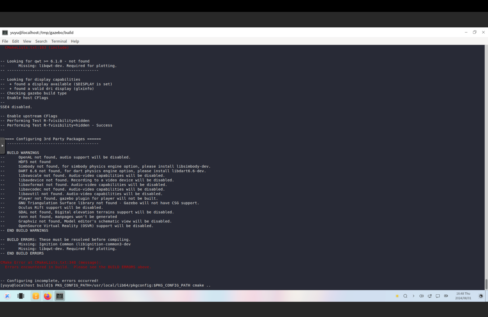
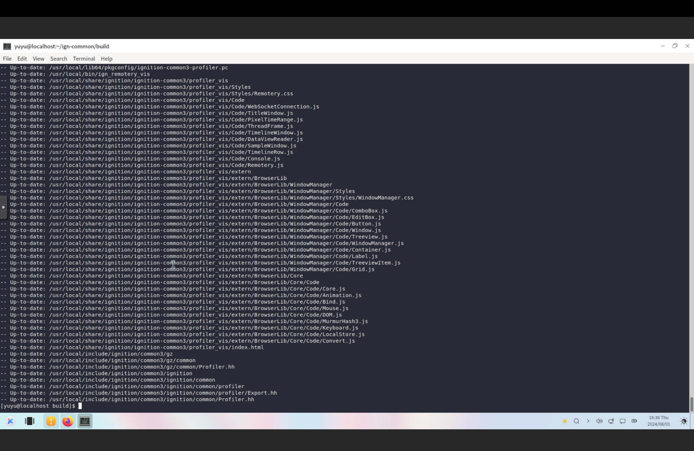

# Gazebo 调研报告


## 整体情况

目前在 openeuler 24.03 x86 上从源码编译 Gazebo 遇到了如下问题：

- 大部分的包都能被 yum 找到或者通过源码编译，但是无法通过 yum 找到 qt-devel，如果尝试从源码编译，使用 yum 安装的 qt-base 不包括 qmake，无法从源码编译。
- 缺包 **libqwt-dev**

如下图：



- 在从源码编译到正确 `sudo make install` 并且使用 `export` 指令正确指向的情况下，无法识别到 **libignition-common3-dev**。





## 包状况

> 说明：以下包顺序为安装顺序
> 括号内 yum 代表可以直接通过 yum 安装，BFS 则是需要从源码编译

1. protobuf*(yum)
2. ign-cmake(BFS)
3. gz-math6(BFS)
4. sdformat9(BFS)
    4.1 boost-devel(yum)
    4.2 tinyxml2(yum)
    4.3 rubygem-rexml(yum)
5. freeimage-devel(yum)
6. libtar-devel(BFS)
7. ogre3d-devel(BFS)
8. qt-devel(BFS faild)
9. ign-msgs5(BFS)
10. ign-transport8(BFS)
11. ign-common(BFS)
12. gz-math4(BFS)
    12.1 ign-cmake0(BFS)
13. ign-fuel-tools(BFS)
    13.1 jsoncpp-devel(yum)
    13.2 libzip-devel(yum)

### export 指向

```
export CMAKE_PREFIX_PATH=/usr/local:$CMAKE_PREFIX_PATH

export PKG_CONFIG_PATH=/usr/local/lib64/pkgconfig:$PKG_CONFIG_PATH
```